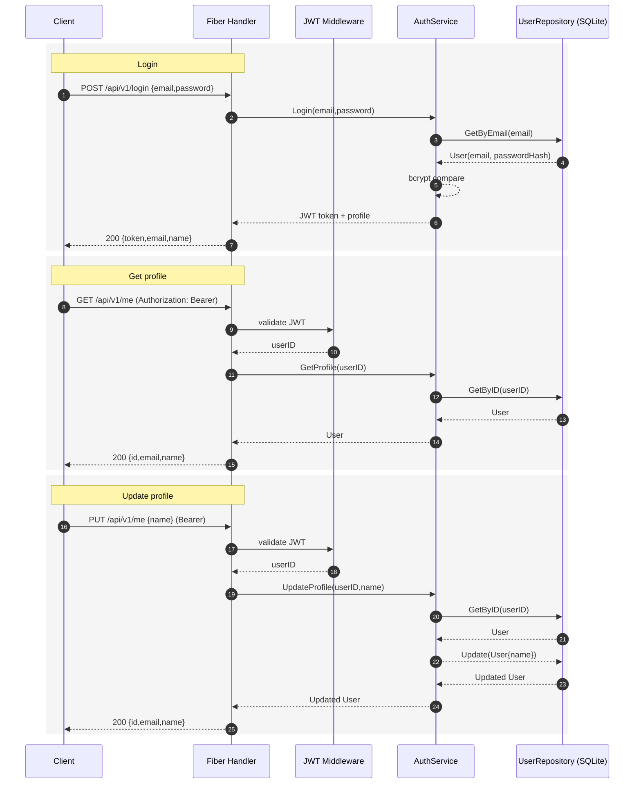

## Cursor Backend API

Minimal Go Fiber API using Clean Architecture.

### Architecture
- Domain: `internal/models`
- Use cases: `internal/usecases`
- Interfaces (HTTP): `internal/handlers`, `internal/routes`
- Infrastructure (adapters): `internal/storage/memory`
- Wiring: `cmd/main.go`

Flow: HTTP -> handlers -> usecases -> repositories (interface) -> storage (implementation)

### Endpoints (base `/api/v1`)
- GET `/healthz`
- POST `/api/v1/login` { "email": "...", "password": "..." }
- GET `/api/v1/me` (Bearer token)
- PUT `/api/v1/me` { "name": "..." } (Bearer token)

### Sequence diagrams (Mermaid)


### Run locally
```bash
export PORT=8080
export SQLITE_DSN="file:app.db?cache=shared&mode=rwc"
export JWT_SECRET="change-me"
go mod tidy
go run ./cmd
```

### Example
```bash
curl -s -X POST http://localhost:8080/api/v1/todos/ \
  -H 'Content-Type: application/json' \
  -d '{"title":"first"}'
```

### Layout
```
cmd/
  main.go
internal/
  handlers/
    auth_handler.go
  middleware/
    jwt_middleware.go
  models/
    user.go
  repositories/
    user_repository.go
  routes/
    routes.go
  storage/
    sqlite/
      user_sqlite.go
  usecases/
    auth_service.go
```

